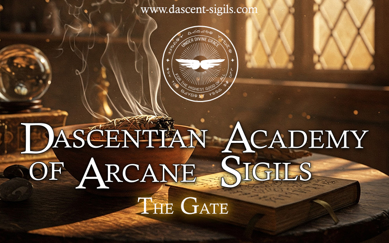

# ⚡ D A S C E N T ⚡
### *The Persona Behind the Magic — Navigating Dimensions, Logic & Manifestation*

  
  
  
  

---

## 🌌 About Dascent

> *"I am Dan from Romania. Like yourself, I had my share of challenges long time ago.*  
> *Dascent, the persona behind the magic.*  
>  
> *I'm a self-taught practitioner of knowledge. I don't align with any established dogma or principle because I have discovered a dimension in which many truths can reside. I navigate dimensions and realities—sometimes my own, sometimes co-created—and all are, in that sense, traps.*  
>  
> *I decided to use energetic symbols known as magic sigils because they are the bridge between logic, intuition, and manifestation."*

---

## ✨ Featured Service: The Entity Signature Sigil

| 🔮 **Entity Signature Sigil Reading** |
| :--- |
| A syncretic esoteric reading with both **visual** and **informative** output, crafted to bridge logic, intuition, and manifestation. |
|  |
| [👉 **Discover & Order Your Signature Sigil Here** 👈](https://dascent-sigils.com/order-your-signature-sigil/) |

---

## 🔮 Arcane Web Applications & Tools

Explore interactive digital tools created to assist in visualization, meditation, and sigil creation:

<table align="center" width="100%">
  <tr>
    <td width="50%" valign="top" align="center">
      <h3>🌀 Arcane Sigils Generator</h3>
      
Generate intricate arcane symbols and sigils directly in your browser.

      
    </td>
    <td width="50%" valign="top" align="center">
      <h3>✨ Interactive Sigil Generator</h3>
      
A web tool designed for intuitive sigil construction, meditation, and visual manifestation.

      
    </td>
  </tr>
</table>

---

## 📖 Deep Dives & Esoteric Insights

<b>📜 What is an Entity Signature Sigil? (Click to Expand)</b>

 

An **Entity Signature Sigil** is a custom syncretic reading designed to translate energetic archetypes into both a visual symbol (sigil) and detailed written intuitive insights. It serves as a tool for self-discovery, empowerment, and alignment with your core energy.

* **Visual Output:** A unique, handcrafted digital sigil symbol.
* **Informative Output:** Deep energetic breakdown and archetype analysis.
* **Purpose:** Acts as a mirror to your inner power and a catalyst for manifestation.

[👉 Learn more or request a personalized reading](https://dascent-sigils.com/order-your-signature-sigil/)

<b>📐 Dascentian Symbols & Script Matrix</b>

 

Constructed using geometry, matrices like the Flower of Life, and intuitive asemic glyphs, Dascentian symbols replace traditional script characters to create standalone energy representatives for sigil crafting.

Check out the interactive script converter on the main website: [Dascentian Symbols Script](https://dascent-sigils.com/glossary/dascentiansymbols-script/)

<b>🛠 Tech Stack & Frameworks</b>

 

- **Frontend / Apps:** HTML5 Canvas, JavaScript, WebGL / Interactive Graphic Tools
- **Platform:** GitHub Pages, WordPress / Custom Web Portals
- **Esoteric Arts:** Sigil Magic, Syncretic Esotericism, Symbolic Scripting & Energy Mapping

---

## 🌐 Connect & Support

 

  
  
  

---

*"In a dimension where many truths reside, symbols become the bridge."* — **Dan (Dascent)**

